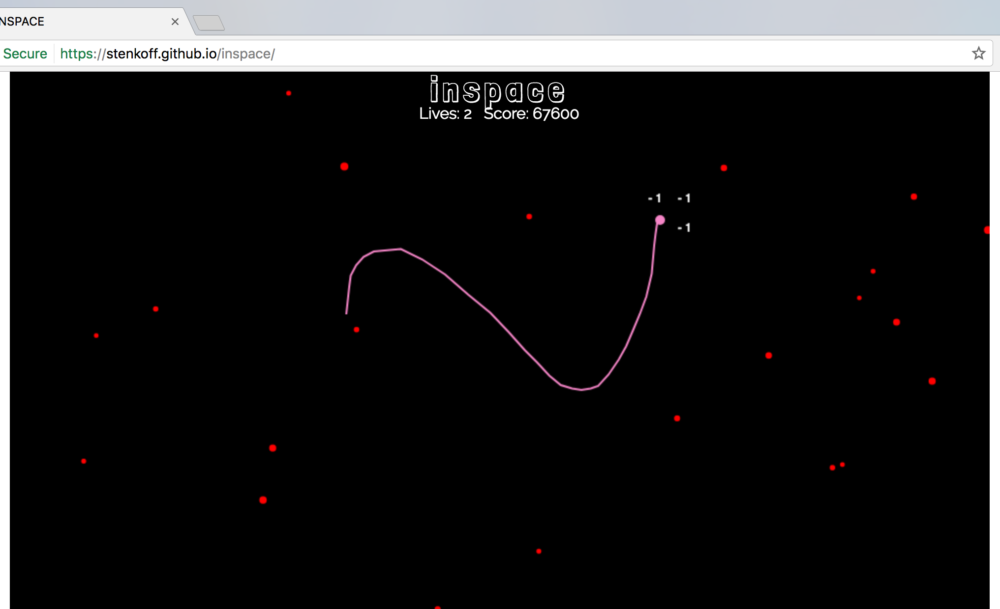

## Inspace
[Live!](https://stenkoff.github.io/inspace/)

### Background
Inspace is a browser game inspired by the game Sinuous built entirely with JavaScript, HTML and CSS through object oriented programming. The goal of the game is to stay alive as long as possible in order to achieve a high score. Players can stay alive by avoiding collisions with the red dots. Players can capture other colored dots to get temporary power boosts, such as slowing the speed of the red dots.

### Features

#### Canvas
Inspace implements HTML5 canvas for precise pixel control and object rendering.

#### Collision Detection
Using HTML5 canvas and a distance formula, Inspace successfully checks for collisions between two dots by calculating if the distance between those objects is less than the sum of their radii.

#### Mouse Position
Inspace uses an event listener on the mouse to track and set the player's position based on the current mouse coordinates

#### High Score
The game keeps track of a high score using local storage, so the player's high score is saved during the browsers session even if the browser is refreshed.

